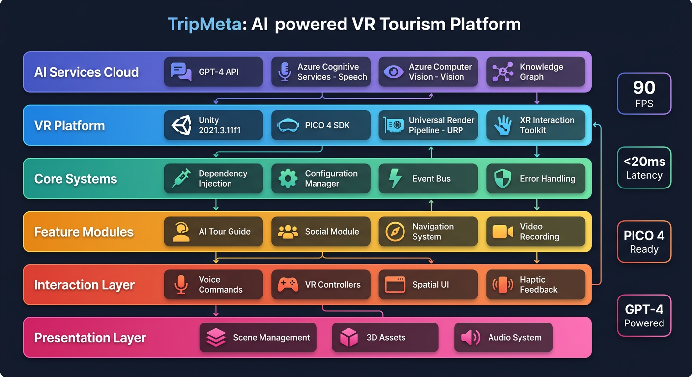

# TripMeta - AI-Powered VR Tourism Platform

<div align="center">

<!-- Banner image will be added later -->

# 
[
[
[

**An immersive VR tourism experience powered by AI**

**English** • [简体中文](README_CN.md)

[Live Demo](https://trip-meta.github.io/TripMeta/site/) • [Report Issue](../../issues) • [Contribute](#contributing)

</div>

---

## Quick Links

| Resource | Link |
|----------|------|
| 🌐 **Live Demo** | [trip-meta.github.io/TripMeta/site](https://trip-meta.github.io/TripMeta/site/) |
| 📖 **Documentation** | [TripMeta/docs](./docs) |
| 📹 **Source Code** | [github.com/trip-meta/TripMeta](https://github.com/trip-meta/TripMeta) |
| 🎬 **Demo Video** | [Watch VR Demo](https://trip-meta.github.io/TripMeta/site/vr.mp4) |
| 🐛 **Issue Tracker** | [GitHub Issues](../../issues) |
| 💬 **Discussions** | [GitHub Discussions](../../discussions) |
| 📜 **Changelog** | [Releases](../../releases) |

## Demo Video

https://trip-meta.github.io/TripMeta/site/vr.mp4

---

## Overview

TripMeta is an innovative VR tourism platform combining AI technology with virtual reality. It provides intelligent tour guides and immersive travel experiences where users can:

- 🌍 **Explore** virtual attractions worldwide using PICO VR headsets
- 🤖 **Converse** naturally with AI tour guides powered by GPT
- 📚 **Learn** about history and culture through rich knowledge graphs
- 🎯 **Interact** intuitively using voice dialogue and VR controllers

## System Architecture



**Architecture Highlights:**

| Metric | Target | Status |
|--------|--------|--------|
| **Frame Rate** | 90 FPS | ✅ PICO 4 Ready |
| **Latency** | <20ms | ✅ Motion-to-photon |
| **AI Response** | <2s | ✅ GPT-4 Optimized |
| **Memory Budget** | <4GB | ✅ Optimized |

## Key Features

### 🤖 AI Tour Guide
- **GPT-4o Powered Conversations**: Natural language understanding and generation
- **Personalized Responses**: Context-aware explanations based on user interests
- **Multi-language Support**: English, Chinese, Japanese, and more
- **Rich Knowledge Base**: Historical facts, cultural insights, and travel tips
- **Streaming Responses**: Real-time SSE streaming for faster interaction

### 🎭 AI NPC System
- **Multi-NPC Support**: Multiple AI characters with unique personalities
- **Character Personalities**: Configurable via ScriptableObject (tour guide, merchant, resident, scholar)
- **Independent Contexts**: Each NPC maintains separate conversation history
- **Behavior Tree**: Autonomous behaviors (patrol, greeting, conversing, farewell)
- **Token Tracking**: Per-minute and per-hour token usage monitoring
- **Request Queue**: Concurrent request management (max 3 simultaneous)
- **Conversation Persistence**: Auto-save dialogue history to disk

### 🔄 LLM Fallback System
- **OpenAI GPT-4o**: Primary cloud LLM with streaming support
- **Ollama Local LLM**: Fallback to local models (llama3.2, etc.)
- **Automatic Failover**: Switch to Ollama if OpenAI API fails
- **Dual Streaming**: SSE streaming support for both OpenAI and Ollama

### 🥽 Immersive VR Experience
- **PICO 4 Support**: Optimized for PICO VR headsets
- **90 FPS Performance**: Smooth, comfortable VR experience
- **Low Latency**: <20ms motion-to-photon latency
- **High-Quality Graphics**: Universal Render Pipeline (URP)

### 🎯 Natural Interactions
- **Voice Commands**: Speak naturally to interact with the AI guide
- **VR Controllers**: Intuitive hand tracking and gesture recognition
- **Spatial UI**: Floating interfaces positioned in 3D space
- **Haptic Feedback**: Realistic touch sensations

## Technology Stack

| Component | Technology | Purpose |
|-----------|----------|---------|
| **Game Engine** | Unity 2021.3.11f1 | Core development platform |
| **VR Platform** | PICO 4 | Target VR headset |
| **Render Pipeline** | URP 17.0.3 | High-performance graphics |
| **XR Interaction** | XR Interaction Toolkit 3.0.7 | VR interaction system |
| **Input System** | Unity Input System 1.11.2 | Modern input handling |
| **AI Engine** | GPT-4o via OpenAI API | Conversational AI |
| **Speech** | Azure Cognitive Services | Voice recognition & TTS |
| **Vision** | Azure Computer Vision | Object detection & AR |
| **Networking** | Netcode for GameObjects 2.1.1 | Multiplayer support |
| **ML Agents** | Unity ML Agents 3.0.0 | AI behavior training |

## Project Structure

```
TripMeta/
├── Assets/
│   ├── Scripts/
│   │   ├── AI/              # AI Services (GPT, Speech, Vision)
│   │   ├── Core/            # Infrastructure (DI, Config, Errors)
│   │   ├── Features/        # Business Logic (Tour Guide, Social)
│   │   ├── Interaction/     # Input Handling (VR Controllers)
│   │   ├── Presentation/    # UI/UX Components
│   │   ├── VR/              # PICO Integration
│   │   └── Editor/          # Unity Editor Tools
│   ├── Scenes/              # Unity Scene Files
│   └── Packages/            # Unity Package Manager
├── docs/                    # Documentation
├── README.md                # English Documentation
└── README_CN.md             # Chinese Documentation
```

## Quick Start

### Prerequisites

| Requirement | Version/Platform |
|-------------|------------------|
| **Unity** | 2021.3.11f1 or later |
| **OS** | Windows 10/11 |
| **VR Headset** | PICO 4 (optional) |
| **Git** | Latest version |

### Installation

```bash
# Clone the repository
git clone https://github.com/trip-meta/TripMeta.git
cd TripMeta

# Open in Unity Hub
# 1. Install Unity Hub from unity.com
# 2. Click "Add" → Select this folder
# 3. Open with Unity 2021.3.11f1
```

### First Run Setup

```
Unity Editor Menu:
├── TripMeta
│   ├── Create Configuration Assets  ← Run this first (creates ScriptableObjects)
│   └── Setup Main Scene           ← Run this after config creation
```

1. **Create Configuration Assets**
   - Go to `TripMeta > Create Configuration Assets`
   - Creates ScriptableObject configurations in `Assets/Resources/Config/`
   - Required before first run

2. **Setup Main Scene**
   - Go to `TripMeta > Setup Main Scene`
   - Configures the main scene with required systems
   - Registers all services and initializes the application

3. **Press Play**
   - The application will boot up and show the VR scene
   - Use VR headset or editor preview to explore

## Documentation

| Document | Description |
|----------|-------------|
| [Quick Start Guide](./docs/QUICKSTART.md) | Detailed setup instructions |
| [Architecture](./docs/ARCHITECTURE.md) | System design and patterns |
| [AI Integration](./docs/AI_INTEGRATION.md) | AI services setup |
| [Tech Stack](./docs/TECH_STACK.md) | Complete technology overview |
| [Development Standards](./docs/DEVELOPMENT_STANDARDS.md) | Coding conventions |
| [Testing Guide](./docs/TESTING_GUIDE.md) | Testing strategies |
| [Deployment Guide](./docs/DEPLOYMENT_GUIDE.md) | Build and deploy |
| [Troubleshooting](./docs/TROUBLESHOOTING.md) | Common issues |

## Development Workflow

1. **Fork** the repository
2. **Create** a feature branch:
   ```bash
   git checkout -b feature/your-feature-name
   ```
3. **Commit** your changes:
   ```bash
   git commit -m "feat: add some amazing feature"
   ```
4. **Push** to your branch:
   ```bash
   git push origin feature/your-feature-name
   ```
5. **Open** a Pull Request on GitHub

See [CONTRIBUTING.md](./docs/CONTRIBUTING.md) for detailed guidelines.

## CI/CD

The project uses GitHub Actions for automated testing and building:

| Workflow | Purpose |
|----------|---------|
| **Unity Build and Test** | Automated Unity builds and unit tests |
| **Code Quality Check** | Static analysis and style checks |
| **Performance Tests** | FPS and latency validation |

**Setup Instructions**: See [GitHub Actions Setup Guide](./docs/GITHUB_ACTIONS_SETUP.md)

## Performance Targets

| Metric | Target | Notes |
|---------|--------|-------|
| **Frame Rate** | 90 FPS | PICO 4 requirement |
| **Latency** | <20ms | Motion-to-photon |
| **Memory** | <4GB | Total budget |
| **Draw Calls** | <100 | Per frame optimization |
| **Triangles** | <50K | Per scene limit |

## Contributing

We welcome contributions! Please read our [Contributing Guidelines](./docs/CONTRIBUTING.md).

**Areas of Contribution**:
- 🐛 Bug fixes
- ✨ New features
- 📖 Documentation improvements
- 🎨 UI/UX enhancements
- ⚡ Performance optimizations
- 🌍 Multi-language support

## License

This project is licensed under the **MIT License**.

```
MIT License

Copyright (c) 2025 TripMeta Contributors

Permission is hereby granted, free of charge, to any person obtaining a copy
of this software and associated documentation files (the "Software"), to deal
in the Software without restriction...
```

See [LICENSE](LICENSE) file for full text.

## Acknowledgments

Built with amazing open-source technologies:

- [Unity Technologies](https://unity.com/) - Game Engine
- [PICO Interactive](https://www.pico-interactive.com/) - VR Platform
- [OpenAI](https://openai.com/) - AI Services
- [Microsoft Azure](https://azure.microsoft.com/) - Cloud Services

## Roadmap

- [x] Initial release with AI tour guide
- [x] PICO 4 VR support
- [x] Real-time translation (新增：支持 14+ 语言的文本/语音翻译)
- [x] Multi-user VR sessions (新增：基于 Unity Netcode 的多人VR同步)
- [x] AR attraction overlays (新增：Azure Computer Vision AR 景点识别)
- [x] Mobile app companion (新增：iOS/Android 配套移动应用)
- [x] Unity 2022.3 upgrade (新增：升级到 Unity 2022.3 LTS)

---

<div align="center">

**[⬆ Back to Top](#tripmeta---ai-powered-vr-tourism-platform)**

Made with ❤️ by the [TripMeta Team](../../graphs/contributors)

**[⭐ Star us on GitHub!](../../stargazers)**

</div>
