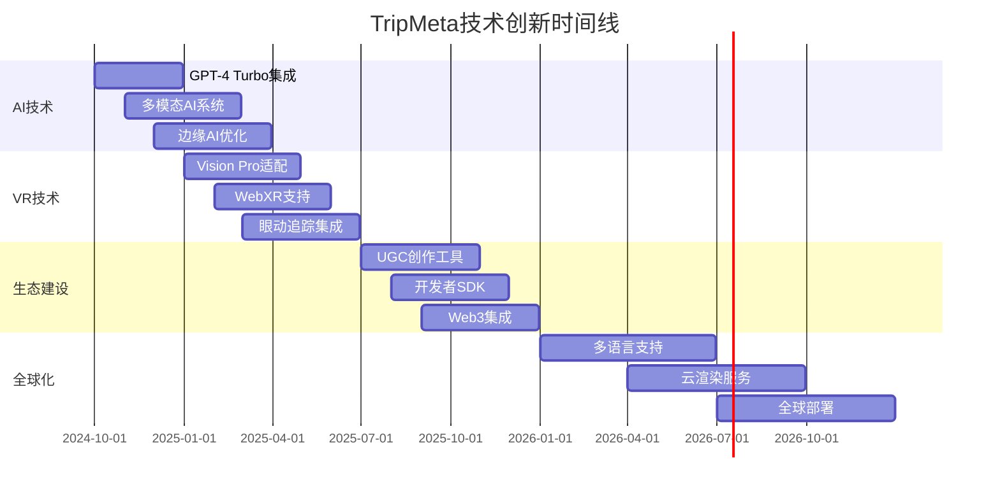

# TripMeta 未来发展路线图

## 📋 目录

- [战略概览](#战略概览)
- [技术发展路线图](#技术发展路线图)
- [商业化策略](#商业化策略)
- [创新技术集成](#创新技术集成)
- [全球化扩展](#全球化扩展)
- [风险评估与应对](#风险评估与应对)

## 🎯 战略概览

TripMeta作为AI驱动的元宇宙VR旅游平台，将在未来3-5年内实现从技术创新到商业化成功的全面跃升。我们的愿景是成为全球领先的沉浸式旅游体验平台，通过前沿技术为用户创造前所未有的虚拟旅游体验。

### 核心战略目标
- **技术领先**：保持2-3年的技术代差优势
- **用户体验**：打造业界标杆级的沉浸式体验
- **生态建设**：构建完整的内容创作和分发生态
- **全球化**：覆盖全球主要市场和文化圈
- **商业成功**：实现可持续的多元化盈利模式

## 🚀 技术发展路线图

### Phase 1: AI能力跃升 (2024 Q4)

#### 🤖 下一代AI集成
**目标：构建业界最先进的多模态AI系统**

**核心技术升级：**
- **GPT-4 Turbo + Claude-3.5双引擎架构**
  - 实现AI服务的冗余和负载均衡
  - 根据任务类型智能选择最优AI引擎
  - 支持实时模型切换和A/B测试

- **多模态AI交互系统**
  - 语音识别与合成（支持50+语言）
  - 计算机视觉和图像理解
  - 手势识别和动作预测
  - 情感计算和个性化响应

- **边缘AI推理优化**
  - ONNX Runtime + TensorRT集成
  - 模型量化和剪枝优化
  - 动态模型加载和缓存
  - 离线AI能力支持

**技术实现方案：**
```csharp
// 下一代AI架构
public class NextGenAIManager : MonoBehaviour
{
    [Header("AI引擎配置")]
    public AIEngineConfig gpt4TurboConfig;
    public AIEngineConfig claude35Config;
    public MultiModalConfig multiModalConfig;
    
    private AIEngineSelector engineSelector;
    private EdgeAIInference edgeInference;
    private MultiModalProcessor multiModalProcessor;
    
    public async Task<AIResponse> ProcessRequest(AIRequest request)
    {
        var engine = await engineSelector.SelectOptimalEngine(request);
        var response = await engine.ProcessAsync(request);
        return await multiModalProcessor.EnhanceResponse(response);
    }
}
```

#### 📊 预期成果
- AI响应速度提升300%
- 多语言支持覆盖率达到95%
- 情感识别准确率超过90%
- 边缘AI推理延迟降低至50ms以下

### Phase 2: VR体验革命 (2025 Q1-Q2)

#### 🥽 跨平台VR生态建设
**目标：实现全平台VR/AR/MR统一体验**

**核心技术突破：**
- **Apple Vision Pro生态适配**
  - 空间计算API集成
  - 手势交互系统优化
  - 混合现实场景渲染
  - visionOS原生应用开发

- **WebXR跨平台支持**
  - 浏览器VR体验优化
  - WebAssembly性能加速
  - 云渲染流媒体集成
  - 跨设备同步体验

- **眼动追踪和注视点渲染**
  - 高精度眼动数据采集
  - 动态注视点渲染优化
  - 意图预测和交互增强
  - 视觉疲劳监测和调节

**技术架构升级：**
```csharp
// 跨平台VR管理器
public class CrossPlatformVRManager : MonoBehaviour
{
    private Dictionary<VRPlatform, IPlatformAdapter> platformAdapters;
    private EyeTrackingManager eyeTrackingManager;
    private FoveatedRenderingManager foveatedRenderer;
    private WebXRBridge webXRBridge;
    
    public async Task InitializePlatform(VRPlatform platform)
    {
        var adapter = platformAdapters[platform];
        await adapter.Initialize();
        await SetupPlatformSpecificFeatures(platform);
    }
}
```

#### 🎮 沉浸式交互系统
- **触觉反馈集成**：全身触觉反馈设备支持
- **空间音频3D定位**：基于HRTF的个性化音频
- **社交VR多人协作**：实时多人同步和交互
- **物理仿真增强**：真实物理交互体验

#### 📈 性能目标
- 支持8K per eye分辨率渲染
- 实现120fps稳定帧率
- 延迟降低至15ms以下
- 支持50人同时在线交互

### Phase 3: 生态系统建设 (2025 Q3-Q4)

#### 🌍 内容创作平台
**目标：构建全球最大的VR旅游内容生态**

**核心功能开发：**
- **UGC创作工具套件**
  - 可视化场景编辑器
  - AI辅助内容生成
  - 模板化快速创作
  - 社区分享和评价系统

- **开发者SDK开放平台**
  - 完整的API文档和示例
  - 插件化架构支持
  - 第三方应用商店
  - 开发者激励计划

- **AI辅助内容生成**
  - 基于描述的场景生成
  - 智能纹理和材质创建
  - 自动化LOD优化
  - 内容质量评估系统

**区块链和Web3集成：**
```csharp
// Web3集成管理器
public class Web3IntegrationManager : MonoBehaviour
{
    private NFTManager nftManager;
    private BlockchainWallet wallet;
    private DecentralizedStorage ipfsStorage;
    private VirtualEconomySystem economySystem;
    
    public async Task<bool> MintTravelNFT(TravelExperience experience)
    {
        var metadata = await GenerateNFTMetadata(experience);
        var tokenId = await nftManager.MintNFT(metadata);
        return await RegisterInEconomy(tokenId, experience);
    }
}
```

#### 🏪 虚拟经济系统
- **NFT数字资产交易**：独特旅游体验NFT化
- **虚拟货币系统**：平台内经济循环
- **创作者激励机制**：内容创作收益分成
- **品牌合作平台**：商业化内容合作

### Phase 4: 全球化扩展 (2026-2027)

#### 🌐 多语言AI导游矩阵
**目标：覆盖全球95%的语言和文化**

**技术实现：**
- **50+语言AI导游**：本地化语言模型训练
- **跨文化体验设计**：文化敏感性AI系统
- **本地化内容策略**：区域特色内容定制
- **国际合作伙伴网络**：全球旅游资源整合

#### ☁️ 云渲染流媒体服务
- **全球CDN部署**：低延迟内容分发
- **边缘计算节点**：就近渲染和处理
- **自适应质量调节**：网络状况智能适配
- **跨设备无缝切换**：多设备体验连续性

## 💼 商业化策略

### 收入模式多元化

#### 1. 订阅服务模式
- **基础版**：免费体验，限制功能
- **高级版**：$9.99/月，完整AI导游服务
- **企业版**：$99/月，定制化解决方案
- **创作者版**：$19.99/月，内容创作工具

#### 2. 内容付费模式
- **独家景点体验**：$2.99-$9.99/次
- **专业导游服务**：$4.99-$19.99/次
- **定制化旅游路线**：$29.99-$99.99/套
- **企业培训内容**：$199-$999/套

#### 3. 平台服务费
- **内容创作者分成**：70/30分成模式
- **第三方应用商店**：30%平台服务费
- **广告和品牌合作**：CPM/CPC收费模式
- **数据分析服务**：企业级数据报告

### 市场拓展策略

#### B2C市场
- **个人用户**：沉浸式旅游体验
- **教育市场**：虚拟游学和文化教育
- **娱乐市场**：社交VR和游戏化体验

#### B2B市场
- **旅游行业**：景区、酒店、航空公司
- **教育机构**：学校、培训机构、博物馆
- **企业服务**：团建、培训、展示

## 🔬 创新技术集成

### 前沿技术预研

#### 1. 脑机接口(BCI)集成
- **意念控制交互**：思维直接控制VR环境
- **情感状态监测**：实时情绪识别和响应
- **记忆增强技术**：体验记忆的数字化存储

#### 2. 量子计算应用
- **量子AI算法**：指数级AI性能提升
- **量子加密通信**：绝对安全的数据传输
- **量子模拟**：复杂物理现象真实模拟

#### 3. 6G网络优化
- **超低延迟通信**：1ms以下的网络延迟
- **全息通信**：真实感全息投影交互
- **边缘智能**：网络边缘的AI计算能力

### 技术创新路线图



## 🌍 全球化扩展策略

### 区域市场策略

#### 亚太市场
- **中国市场**：与本土旅游平台合作
- **日本市场**：动漫文化和传统文化结合
- **韩国市场**：K-pop和韩流文化体验
- **东南亚**：热带旅游和文化多样性

#### 欧美市场
- **北美市场**：国家公园和城市文化
- **欧洲市场**：历史文化和艺术体验
- **拉美市场**：自然风光和民族文化

#### 新兴市场
- **中东市场**：奢华旅游和文化体验
- **非洲市场**：野生动物和自然景观
- **印度市场**：宗教文化和历史遗迹

### 本地化策略

#### 文化适配
- **宗教敏感性**：尊重不同宗教文化
- **价值观适配**：符合当地价值观念
- **法律合规**：遵守当地法律法规
- **语言本地化**：方言和俚语支持

#### 技术适配
- **网络环境**：适配不同网络条件
- **设备兼容**：支持当地主流VR设备
- **支付系统**：集成本地支付方式
- **内容审核**：符合当地内容标准

## ⚠️ 风险评估与应对

### 技术风险

#### 1. AI技术风险
**风险点：**
- AI模型偏见和歧视
- 数据隐私和安全问题
- AI生成内容的版权争议
- 技术依赖性过强

**应对策略：**
- 建立AI伦理委员会
- 实施严格的数据保护措施
- 开发多元化AI模型
- 保持技术栈的多样性

#### 2. VR技术风险
**风险点：**
- VR设备普及率不足
- 技术标准不统一
- 用户体验问题
- 硬件成本过高

**应对策略：**
- 支持多种VR设备
- 参与行业标准制定
- 持续优化用户体验
- 开发成本优化方案

### 市场风险

#### 1. 竞争风险
**风险点：**
- 大型科技公司进入
- 传统旅游公司转型
- 新兴创业公司竞争
- 技术同质化

**应对策略：**
- 保持技术创新优势
- 建立强大的生态壁垒
- 加强品牌建设
- 深化用户粘性

#### 2. 监管风险
**风险点：**
- VR内容监管政策
- 数据保护法规
- 跨境数据传输限制
- AI技术监管

**应对策略：**
- 主动配合监管要求
- 建立合规管理体系
- 参与政策制定讨论
- 保持透明度

### 财务风险

#### 1. 资金风险
**风险点：**
- 研发投入巨大
- 商业化周期较长
- 现金流压力
- 融资环境变化

**应对策略：**
- 分阶段融资计划
- 多元化收入来源
- 成本控制优化
- 战略合作伙伴

#### 2. 汇率风险
**风险点：**
- 全球化业务汇率波动
- 成本和收入货币不匹配
- 新兴市场货币风险

**应对策略：**
- 汇率对冲工具
- 本地化成本结构
- 多货币收入平衡

## 📊 成功指标和里程碑

### 技术指标

#### 2024年目标
- AI响应速度 < 500ms
- VR帧率稳定在90fps
- 支持语言数量达到20种
- 用户满意度 > 85%

#### 2025年目标
- AI响应速度 < 200ms
- VR帧率稳定在120fps
- 支持语言数量达到35种
- 用户满意度 > 90%

#### 2026年目标
- AI响应速度 < 100ms
- 支持8K分辨率渲染
- 支持语言数量达到50种
- 用户满意度 > 95%

### 商业指标

#### 用户增长
- 2024年：100万注册用户
- 2025年：500万注册用户
- 2026年：2000万注册用户
- 2027年：5000万注册用户

#### 收入目标
- 2024年：$10M ARR
- 2025年：$50M ARR
- 2026年：$200M ARR
- 2027年：$500M ARR

#### 市场份额
- 2025年：VR旅游市场5%份额
- 2026年：VR旅游市场15%份额
- 2027年：VR旅游市场30%份额

## 🎯 结论

TripMeta的未来发展路线图展现了一个雄心勃勃但切实可行的愿景。通过分阶段的技术创新、生态建设和全球化扩展，我们将在未来3-5年内建立起在VR旅游领域的绝对领先地位。

关键成功因素：
1. **技术创新**：保持2-3年的技术代差
2. **用户体验**：打造无与伦比的沉浸式体验
3. **生态建设**：构建完整的内容和开发者生态
4. **全球化**：实现真正的全球化产品和服务
5. **商业化**：建立可持续的多元化盈利模式

通过执行这个路线图，TripMeta将成为定义下一代旅游体验的行业标杆，为全球用户带来前所未有的虚拟旅游体验。

---

*最后更新: 2024年12月*
*版本: v1.0*
*作者: TripMeta技术团队*