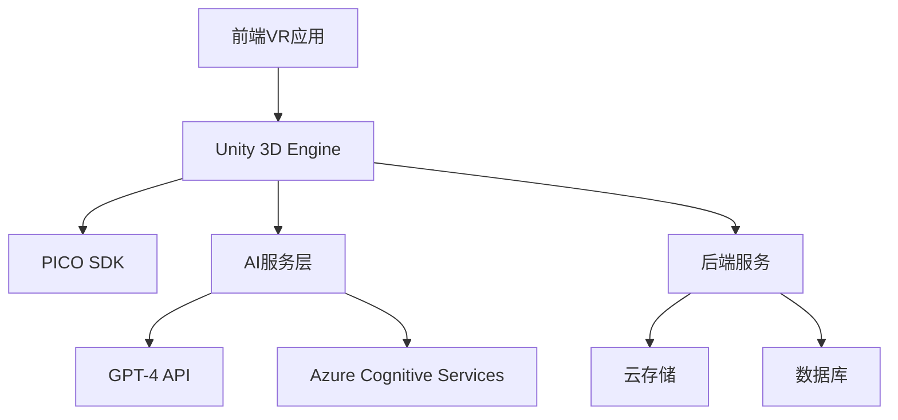

# TripMeta 技术栈说明文档

## 📋 目录

- [技术栈概览](#技术栈概览)
- [核心技术](#核心技术)
- [开发工具](#开发工具)
- [第三方库](#第三方库)
- [部署架构](#部署架构)
- [版本要求](#版本要求)

## 🏗️ 技术栈概览

TripMeta采用现代化的技术栈，结合Unity 3D、AI服务和云原生架构，构建高性能的VR旅游平台。



## 🎮 核心技术

### VR开发平台
- **Unity 3D 2022.3 LTS**
  - 版本: 2022.3.12f1
  - 渲染管线: Universal Render Pipeline (URP)
  - 平台支持: Windows, Android (PICO)
  - 脚本语言: C# 9.0+

- **PICO Unity Integration SDK v2.1.1**
  - VR头显支持: PICO 4, PICO 4 Enterprise
  - 交互系统: 手柄追踪、手势识别
  - 空间定位: 6DOF追踪
  - 渲染优化: Fixed Foveated Rendering

### AI技术栈
- **大语言模型**
  - OpenAI GPT-4 API
  - Azure OpenAI Service
  - 本地推理: ONNX Runtime

- **计算机视觉**
  - Azure Computer Vision API
  - OpenCV 4.8+
  - 实时图像处理和分析

- **语音技术**
  - Azure Speech Services
  - 语音识别 (STT)
  - 语音合成 (TTS)
  - 实时翻译

- **推荐系统**
  - 协同过滤算法
  - 内容基础推荐
  - 深度学习推荐模型

## 🛠️ 开发工具

### 集成开发环境
- **Visual Studio 2022**
  - Unity开发扩展
  - C# IntelliSense
  - 调试工具

- **Unity Editor 2022.3 LTS**
  - Package Manager
  - Profiler工具
  - XR Interaction Toolkit

### 版本控制
- **Git 2.40+**
  - 分布式版本控制
  - 分支管理策略
  - Git LFS (大文件支持)

- **GitHub**
  - 代码托管
  - CI/CD Actions
  - Issue跟踪

### 构建和部署
- **Unity Cloud Build**
  - 自动化构建
  - 多平台支持
  - 版本管理

- **Docker**
  - 容器化部署
  - 微服务架构
  - 环境一致性

## 📦 第三方库和组件

### Unity包管理
```json
{
  "dependencies": {
    "com.unity.xr.interaction.toolkit": "2.5.2",
    "com.unity.render-pipelines.universal": "14.0.8",
    "com.unity.addressables": "1.21.17",
    "com.unity.analytics": "4.4.0",
    "com.unity.cloud.build": "1.0.6",
    "com.unity.inputsystem": "1.7.0",
    "com.unity.textmeshpro": "3.0.6",
    "com.unity.timeline": "1.7.5",
    "com.unity.cinemachine": "2.9.7"
  }
}
```

### AI和机器学习
- **ML-Agents 2.0**
  - 强化学习框架
  - 智能NPC行为
  - 环境交互学习

- **Barracuda 3.0**
  - Unity神经网络推理
  - ONNX模型支持
  - GPU加速计算

### 网络和通信
- **Mirror Networking**
  - 多人网络框架
  - 客户端-服务器架构
  - 实时同步

- **WebRTC**
  - 实时音视频通信
  - P2P连接
  - 低延迟传输

### UI和交互
- **UI Toolkit**
  - 现代UI系统
  - 响应式设计
  - 高性能渲染

- **XR Interaction Toolkit**
  - VR交互组件
  - 手势识别
  - 空间UI

## ☁️ 云服务和基础设施

### 云平台
- **Microsoft Azure**
  - 计算服务: Azure Virtual Machines
  - 存储服务: Azure Blob Storage
  - 数据库: Azure Cosmos DB
  - AI服务: Azure Cognitive Services

### 内容分发
- **Azure CDN**
  - 全球内容分发
  - 低延迟访问
  - 缓存优化

### 监控和分析
- **Azure Application Insights**
  - 性能监控
  - 错误跟踪
  - 用户行为分析

- **Unity Analytics**
  - 游戏数据分析
  - 用户留存分析
  - 收入分析

## 🗄️ 数据存储

### 数据库
- **Azure Cosmos DB**
  - NoSQL文档数据库
  - 全球分布
  - 多模型支持

- **Azure SQL Database**
  - 关系型数据库
  - 用户管理
  - 交易数据

### 缓存
- **Redis Cache**
  - 内存缓存
  - 会话存储
  - 实时数据

### 文件存储
- **Azure Blob Storage**
  - 3D模型资源
  - 纹理贴图
  - 音频文件

## 🔧 开发和运维工具

### 代码质量
- **SonarQube**
  - 代码质量分析
  - 安全漏洞检测
  - 技术债务管理

- **Unity Code Analysis**
  - C#代码分析
  - 性能优化建议
  - 最佳实践检查

### 测试框架
- **Unity Test Framework**
  - 单元测试
  - 集成测试
  - 性能测试

- **NUnit 3.13**
  - .NET测试框架
  - 断言库
  - 测试运行器

### 性能分析
- **Unity Profiler**
  - CPU性能分析
  - 内存使用分析
  - 渲染性能监控

- **PICO Developer Tools**
  - VR性能监控
  - 帧率分析
  - 热点检测

## 📱 平台支持

### VR设备
- **PICO 4**
  - Snapdragon XR2 Gen 1
  - 4K+ 显示屏
  - 6DOF追踪

- **PICO 4 Enterprise**
  - 企业级功能
  - 设备管理
  - 安全增强

### 操作系统
- **Android 10+**
  - PICO OS 5.0+
  - OpenXR支持
  - Vulkan API

- **Windows 10/11**
  - 开发环境
  - 测试平台
  - 内容创作

## 🔒 安全技术

### 身份认证
- **Azure Active Directory B2C**
  - 用户身份管理
  - 社交登录
  - 多因素认证

### 数据加密
- **TLS 1.3**
  - 传输层加密
  - 端到端安全
  - 证书管理

### API安全
- **OAuth 2.0**
  - 授权框架
  - 访问令牌
  - 权限控制

## 📊 版本要求

### 最低要求
```yaml
Unity: 2022.3.0f1
.NET: 6.0
C#: 9.0
PICO SDK: 2.1.0
Visual Studio: 2022
Git: 2.35.0
```

### 推荐配置
```yaml
Unity: 2022.3.12f1
.NET: 6.0
C#: 10.0
PICO SDK: 2.1.1
Visual Studio: 2022 17.7+
Git: 2.40+
```

## 🚀 性能指标

### VR性能目标
- **帧率**: 90 FPS (稳定)
- **延迟**: <20ms (动作到光子)
- **分辨率**: 4K+ per eye
- **视场角**: 105° diagonal

### AI响应性能
- **语音识别**: <500ms
- **GPT响应**: <2s
- **图像分析**: <1s
- **推荐生成**: <100ms

## 📈 扩展性设计

### 微服务架构
- **服务拆分**: 按功能域划分
- **API网关**: 统一入口管理
- **负载均衡**: 自动扩缩容
- **服务发现**: 动态服务注册

### 数据架构
- **读写分离**: 优化查询性能
- **分库分表**: 水平扩展
- **缓存策略**: 多级缓存
- **CDN加速**: 全球内容分发

---

## 📞 技术支持

如需技术支持或有疑问，请参考：
- [开发文档](./DEVELOPMENT_STANDARDS.md)
- [部署指南](./DEPLOYMENT_GUIDE.md)
- [故障排除](./TROUBLESHOOTING.md)
- [FAQ](./FAQ.md)

---

*最后更新: 2024年12月*